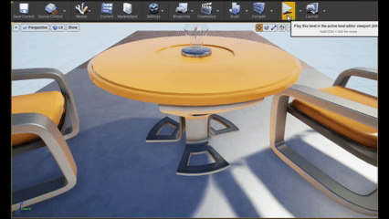

# AirSim + Unreal Engine Windows Guide

## Important

To run a clean setup, previous Airsim file under  
C:\Users\<user>\source\repos needs to be deleted using command in terminal:

rm -rf -force airsim

## Used Guides

### Airsim Windows Setup:
https://microsoft.github.io/AirSim/build_windows/

### Unreal Engine Environment Setup:
https://microsoft.github.io/AirSim/unreal_custenv/

## Prerequisites

### 1. Visual Studio 2022
These add-ons must be included:
- Desktop development with C++
- Windows 10/11 SDK

### 2. Unreal Engine 4.27.2
Installed after installing Epic Games windows app

## After UE Installation

Open VS studio 2022  
Click edit without code  
Open Developer terminal under tools bar  

Enter commands:

git clone https://github.com/microsoft/AirSim.git  
cd AirSim  
build.cmd  

After the build.cmd setup it will automatically generate Block.Uproject files, but this will not do anything.

In this stage, Airsim setup usually encounters a path error where it expects the folder version instead of the UE's flat version.

## Fix

Verify the 4.27.2 version by clicking its arrow logo in its launch platform in Epic Games app then selecting verify.

Run UnrealVersionSelector by typing these commands in powershell as admin:

& "C:\Program Files\Epic Games\UE_4.27\Engine\Binaries\Win64\UnrealVersionSelector.exe" /register  
& "C:\Program Files\Epic Games\UE_4.27\Engine\Binaries\Win64\UnrealVersionSelector.exe" /fileassociations  

Then restart the fileExplorer by typing in powershell:

taskkill /f /im explorer.exe  
start explorer.exe  

Click/Run Blocks.Uproject file inside your Airsim folder after this to build the FlyingExampleMap file. This will auto run the project file itself.

Finally, run these in the powershell to create a Block.sln file. (change <user> to your own pc user):

& "C:\Program Files\Epic Games\UE_4.27\Engine\Binaries\DotNET\UnrealBuildTool.exe" -projectfiles -project="C:\Users\<user>\Documents\AirSim\Unreal\Environments\Blocks\Blocks.uproject" -game -engine  

## (Beginner) Environment Creation

This section helps the user create a beginner Airsim project:

1. Open UE 4.27.2  
2. Create a project with blueprint and blank environment chosen  
3. Go to the project directory and click its .uproject file (this might trigger the build condition to setup the project for Airsim and auto open the project once done)  
4. Once it completes, copy and paste the plugin folder from inside the Airsim directory to your project directory  

Since we are using Visual studio community, the project requires atleast one C++ class to open the visual studio community for the project

5. In the project, Click file then Create C++ class, making it automatically compile a C++ class, auto openning it on VS community once done  

6. On this step, refer to the steps given in the official Microsoft setup guide for setting up Unreal Environment for Airsim. Start from step 5. This is not a blind just-do-it guide since the user needs to modify some steps to make the results fall in specifically to his/her setup:  
https://microsoft.github.io/AirSim/unreal_custenv/

7. Copy paste the script of the step 6 and paste it on your .uproject file and modify it to your project preference. This involves changing the project name  

In the step 8 of the guide, generate visual studio project files wont work since it falls back into the same path error encountered on the generate block.uproject airsim setup.

8. To generate the VS proj file, do it by typing this code in powershell admin. (change <user> to your own pc user):  
& "C:\Program Files\Epic Games\UE_4.27\Engine\Binaries\DotNET\UnrealBuildTool.exe" -projectfiles -project="C:\Users\<user>\Documents\Unreal Projects\TestAirsim2\TestAirsim2.uproject" -game -engine  

## Creating a project

8. Open the project .sln file using vs community 2022  

9. In completting the setup for the programming environment, project code file's debugger must be run on debug game editor under win 64 and by clicking the green arrow icon on the upper bar to build  

The ideal result should be a warning at the end without errors, indicating a successfull build  

(In this Setup, the actual editor target built successfully enough to launch, even though some other projects in the solution failed. There were errors encountered, which are access path errors. This guide would be updated once that error has been resolved.)

10. The Unreal Engine project will be automatically opened upon finishing the build. Under Settings icon, click world settings and choose AirSimGamemode under Game mode settings  

11. Allow access to swarm connection  

12. Press the large play button on the upper bar. It will ask you if you want to use the car simulation which you need to press no  

13. Once done, the drone will appear on the test screen

    
