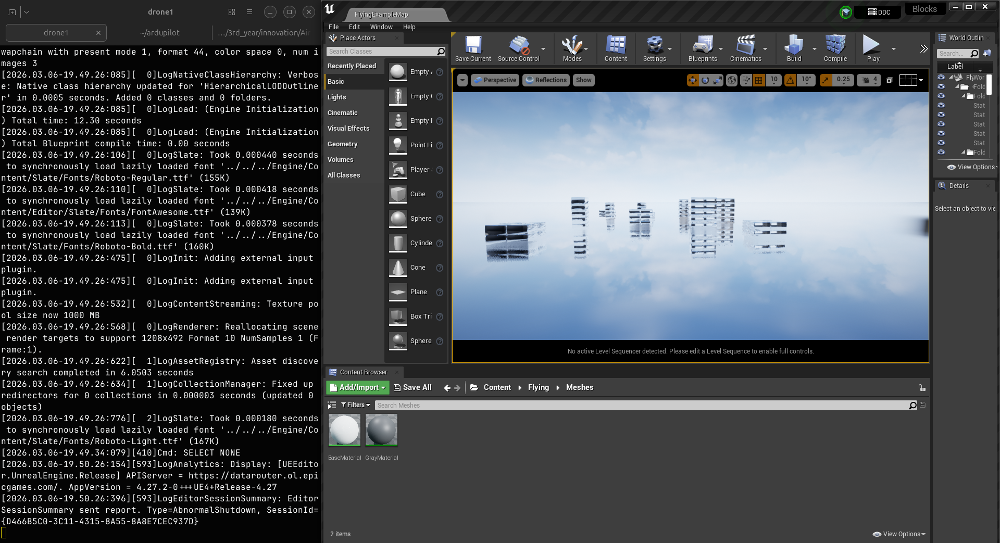
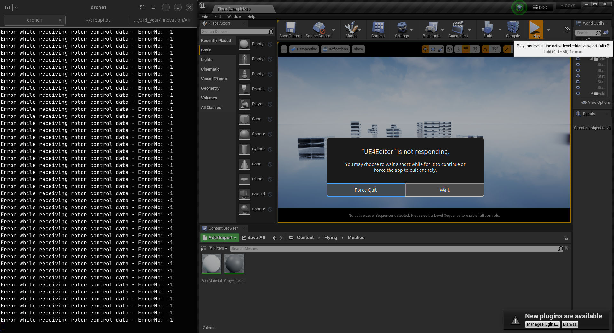
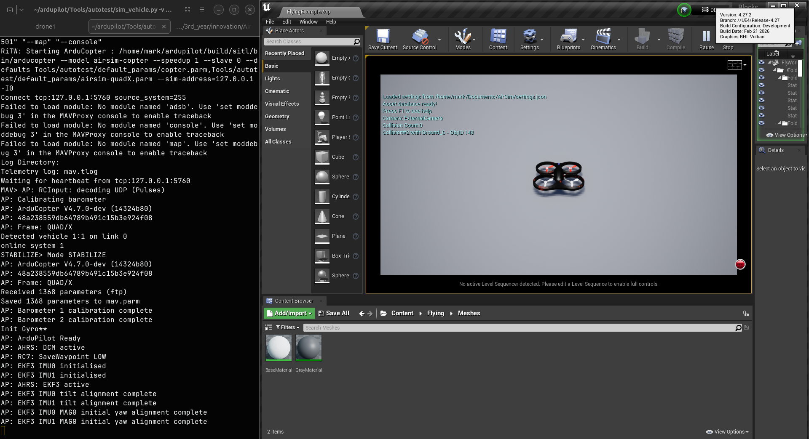
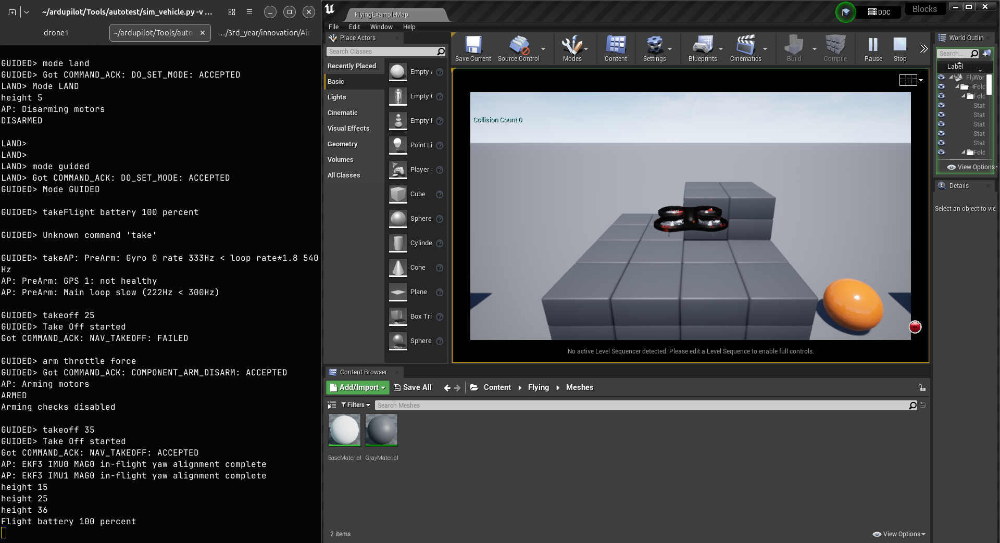

# Step by step guide

Navigate here

/home/mark/AirSim/Unreal/Environments/Blocks

Run this 

~/UnrealEngine/Engine/Binaries/Linux/UE4Editor "$(pwd)/Blocks.uproject"

For easy flow add this in to your shell as an alias

then click on play 

You will get this. Dont panic

go to here

/home/mark/ardupilot

run this 

~/ardupilot/Tools/autotest/sim_vehicle.py -v ArduCopter -f airsim-copter --console --map

commands

https://ardupilot.org/copter/docs/mission-command-list.html

~~~
STABILIZE>
STABILIZE> mode guided
STABILIZE> Got COMMAND_ACK: DO_SET_MODE: ACCEPTED
GUIDED> Mode GUIDED

GUIDED> arm throttle force
GUIDED> Got COMMAND_ACK: COMPONENT_ARM_DISARM: ACCEPTED
AP: Arming motors
ARMED
Arming checks disabled

GUIDED> takeoff 35
GUIDED> Take Off started
Got COMMAND_ACK: NAV_TAKEOFF: ACCEPTED
height 15
height 25
height 36
~~~

~~~
GUIDED> mode land
GUIDED> Got COMMAND_ACK: DO_SET_MODE: ACCEPTED
LAND> Mode LAND
height 26
height 15
height 5
AP: Disarming motors
DISARMED
LAND>
~~~